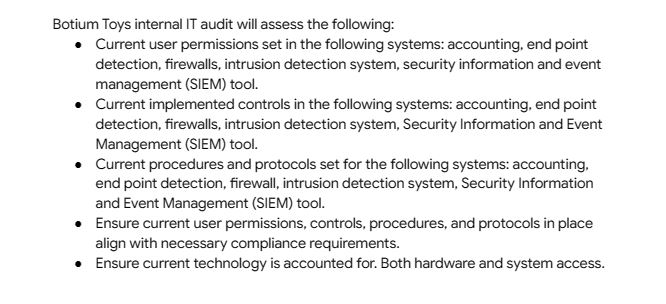
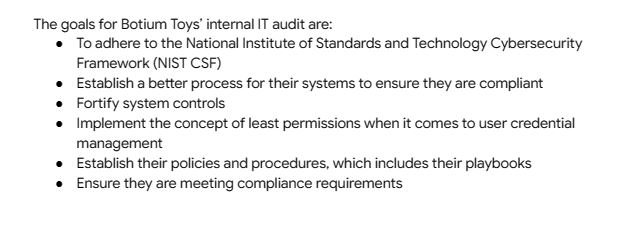
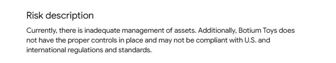
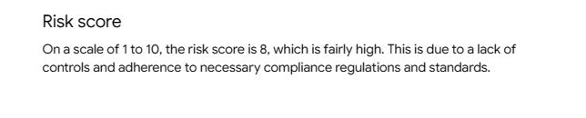
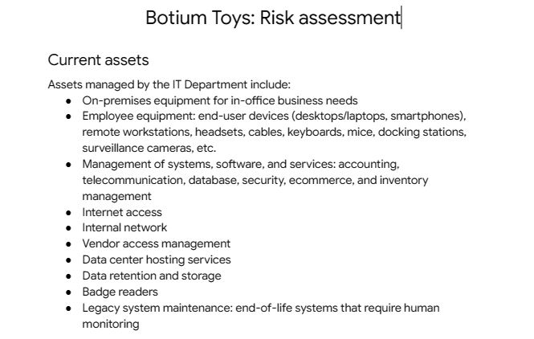

# Enhancing Security Posture: A Comprehensive Security Audit Case Study of Botium Toys

## Introduction
In this repository is an in-depth analysis of the Botium Toys organization's security program. It covers various aspects, including the scope and goals, regulations and standards. It showcases my expertise in conducting a comprehensive security audit and my ability to identify and address potential risks to enhance the organization's security posture.

## Objectives
1. To identify gaps or weaknesses in the security of a company.
2. To ensure an organization's compliance with relevant regulations and standards such as the NIST Cybersecurity Framework and GDPR.
3. To develop and document policies, procedures and playbooks to guide security practices.
4. Provide recommendation for enhancing data prptection, privacy and network measures.

## Skills / Concepts Demonstrated
1. Security Audit
2. Compliance Regulations 
3. Asset Management
4. Risk Mitigation
5. Cross-border Compliance 

## Background Information
Botium Toys is a small U.S. business that develops and sells toys. The business has a single physical location. However, its online presence has grown, attracting customers in the U.S. and abroad. Their information technology (IT) department is under increasing pressure to support their online market worldwide. 

The manager of the IT department has decided that an internal IT audit needs to be conducted. She expresses concerns about not having a solidified plan of action to ensure business continuity and compliance, as the business grows. She believes an internal audit can help better secure the company’s infrastructure and help them identify and mitigate potential risks, threats, or vulnerabilities to critical assets. The manager is also interested in ensuring that they comply with regulations related to accepting online payments and conducting business in the European Union (E.U.).   

The IT manager starts by implementing the National Institute of Standards and Technology Cybersecurity Framework (NIST CSF), establishing an audit scope and goals, and completing a risk assessment. The goal of the audit is to provide an overview of the risks the company might experience due to the current state of their security posture. The IT manager wants to use the audit findings as evidence to obtain approval to expand his department. 

**_Task_**: Your task is to review the IT manager’s scope, goals, and risk assessment. Then, perform an internal audit to complete a controls assessment and compliance checklist. 
**_Note_**: Botium Toys is a fictional organization developed for the sake of this case study.

## Review of Scope, Goals and Risk Assessment 

As stated in the background information, the scope and goals as well as the risk assessment assessment has already been done by the IT Manager. My duty is to review the work done by the manager and develop a control assessemnt and a compliance checklist for the organization.

The diagram above outlines the scope of the audit. 

Upon review, it was established that Botium Toys' internal IT audit aims to assess user permissions, controls, procedures, and protocols in various systems, ensuring compliance and fortifying system controls. The goals of the audit include adhering to the NIST CSF, establishing better processes for compliance, fortifying controls, implementing least privilege principles, and ensuring compliance requirements are met. 

!The risk description highlights inadequate asset management and lack of proper controls, posing a medium potential impact and a high likelihood of lost assets or fines.

## Controls Assessment
The current assets of the organization were reviewed. Below is a list of the current assets of Botium Toys.

Upon review, each asset was given the appropriate control name and control type with a brief description of what each control is supposed to achieve. "X" was assigned to controls that need to be implemented. Also, a priority check was done on each control and grouped according to the priority. Attached is the link to the controls assessment [document](https://view.officeapps.live.com/op/view.aspx?src=https%3A%2F%2Fraw.githubusercontent.com%2FAlberda1612%2FSecurity_Audit%2Fmain%2FControls-assessment.docx&wdOrigin=BROWSELINK) :point_left: 

The second task was to develop a compliance checklist for the organization.
From the background information, Botium physically operates in the USA but has an online market that spans abroad. Also, they are looking to expand their online market to Europe. These are the standard regulations considered; GDPR, PCI DSS, AND SOC Type 1 and SOC Type 2.

**_BRIEF EXPLANATION OF COMPLIANCE_**
1. GDPR : GDPR is an European Union (E.U.) general data regulation that protects the processing of E.U. citizens’ data and their right to privacy in and out of E.U. territory. Botium Toys is expanding its online market to Europe. GDPR governs the protection, processing, and transfer of personal data of individuals within the European Union. Compliance with GDPR ensures that Botium Toys handles personal data of EU residents in a lawful and secure manner, respecting their privacy rights.

2. Payment Card Industry Data Security Standard (PCI DSS) : PCI DSS is an international security standard meant to ensure that organizations storing, accepting, processing, and transmitting credit card information do so in a secure environment. 
Explanation: Since Botium Toys processes payment card transactions, they need to comply with PCI DSS. This standard ensures the secure handling of credit cardholder data and establishes guidelines for maintaining a secure payment environment. Compliance with PCI DSS helps protect customer payment card information and reduces the risk of data breaches and fraud.

3. System and Organizations Controls (SOC type 1, SOC type 2) : The SOC1 and SOC2 are a series of reports that focus on an organization's user access policies at different organizational levels. They are used to assess an organization’s financial compliance and levels of risk. They also cover confidentiality, privacy, integrity, availability, security, and overall data safety. Control failures in these areas can lead to fraud. Botium Toys may need to undergo SOC Type 1 and SOC Type 2 audits to demonstrate their adherence to security, availability, processing, integrity, confidentiality, and privacy controls. These reports are often requested by customers and business partners to assess the effectiveness of an organization’s internal controls.

## Recommendations
It is recommended that critical findings relating to compliance with PCI DSS and GDPR be promptly addressed since Botium Toys accepts online payments from customers worldwide, including the E.U. Having disaster recovery plans and backup is also critical because they support business continuity in the event of an incident, integrating an IDS and Antivirus Software into the current systems will support our ability to identify and mitigate potential risks, and could help with intrusion detection, since existing legacy systems require manual monitoring and intervention. 

## Conclusion
In conclusion, the security audit project at Botium Toys was a comprehensive assessment of their security program, assets, controls, and compliance. Through the evaluation of user permissions, implemented controls, and procedures, the project identified areas of improvement and potential risks. Recommendations were provided to fortify system controls, establish better compliance processes, and implement the concept of least permissions. By addressing these findings and adhering to relevant compliance regulations, Botium Toys can enhance their security posture, protect customer and vendor data, and ensure a resilient and compliant environment for their expanding business operations.

Find the full documentation of the security audit communicating findings :point_right: [here]()

#Thank You :smiley:

